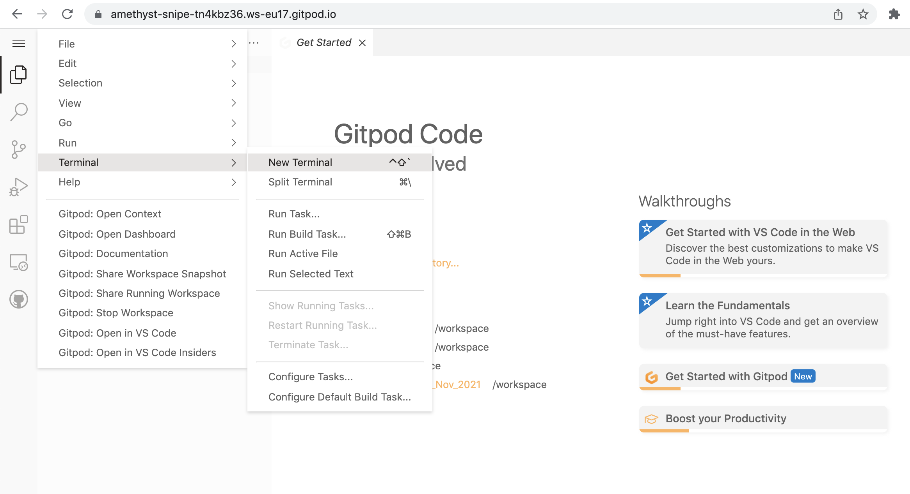

.. _first-page:

*************************
Introduction to Nextflow
*************************

Enabling scalable and reproducible scientific workflows `Nextflow <https://www.nextflow.io>`_ and software containers.

.. tip::
  We can open our test repository in GitPod by clicking this `link <https://gitpod.io/#https://github.com/nextflow-io/elixir-workshop-21>`__. This will take some minutes to set up so we can introduce a bit Nextflow

What is Nextflow?
==================

`Nextflow <https://www.nextflow.io>`_ is a reactive workflow system and a programming DSL that eases the writing of data-intensive computational pipelines.

It enables scalable and reproducible scientific workflows using software containers that can be deployed in a portable manner
across clusters and clouds.

Project documentation is available `at this link <https://www.nextflow.io/docs/latest/>`_. Help and support is available
through the community `Gitter channel <https://gitter.im/nextflow-io/nextflow>`_ and `GitHub discussion group <https://github.com/nextflow-io/nextflow/discussions>`_

Nextflow project was setup at the `Centre for Genomics Regulation (CRG) <https://www.crg.eu>`_, currently is supported by `Seqera Labs <https://www.seqera.io>`_.

What is Nextflow for?
---------------------

It is for making pipelines without caring about parallelization, dependencies, intermediate file names, data structures, handling exceptions, resuming executions, etc.

Nextflow has been published on `Nature Biotechnology <https://pubmed.ncbi.nlm.nih.gov/28398311/>`_.
If you use it in your researcher, please cite it.

.. image:: images/NF_pub.png
  :width: 600

Number of `PubMed <https://pubmed.ncbi.nlm.nih.gov/?term=nextflow&timeline=expanded&sort=pubdate&sort_order=asc>`__ publications with the word Nextflow, while the original paper has been cited 257 times.

.. image:: images/NF_mentioning.png
  :width: 600

A curated list of `Nextflow pipelines <https://github.com/nextflow-io/awesome-nextflow>`__ and a collection of
pipelines written collaboratively by the `nf-core <https://nf-co.re/pipelines>`__ community.

Main advantages
================

Fast prototyping
-------------------

You can quickly write a small pipeline that can be **expanded incrementally**.
**Each task is independent** and can be easily added to other. You can reuse scripts without re-writing or adapting them.

Reproducibility
------------------

Nextflow supports **Docker** and **Singularity** containers technology. Their use will make the pipelines reproducible in any Unix environment. Nextflow is integrated with **GitHub code sharing platform**, so you can call directly a specific version of a pipeline from a repository, download and use it on-the-fly.

Portability
----------------
Nextflow can be executed on **multiple platforms** without modifiying the code. It supports several schedulers such as **SGE, LSF, SLURM, PBS, HTCondor** and cloud platforms like **Kubernetes, Amazon AWS, Google Cloud**.

.. image:: images/executors.png
  :width: 600

Scalability
----------------

Nextflow is based on the **dataflow programming model** which simplifies writing complex pipelines.
The tool takes care of **parallelizing the processes** without additionally written code.
The resulting applications are inherently parallel and can scale-up or scale-out transparently; there is no need to adapt them to a specific platform architecture.

Resumable, thanks to continuous checkpoints
---------------------------------------------

All the intermediate results produced during the pipeline execution are automatically tracked.
For each process **a temporary folder is created and is cached (or not) once resuming an execution**.

Workflow structure
==================

The workflows can be represented as graphs where the nodes are the `processes <https://www.nextflow.io/docs/latest/process.html>`__ and the edges are the `channels <https://www.nextflow.io/docs/latest/channel.html>`__.
The `processes <https://www.nextflow.io/docs/latest/process.html>`__ are blocks of code that can be executed - such as scripts or programs - while the `channels <https://www.nextflow.io/docs/latest/channel.html>`__ are asynchronous queues able to **connect processes among them via input / output**. Some methods, called `operators <https://www.nextflow.io/docs/latest/operator.html>`__ are provided for reshaping and combining the channels. 

.. image:: images/wf_example.png
  :width: 600

Processes are independent from each another and can be run in parallel, depending on the number of elements in a channel.
In the previous example, processes **A**, **B** and **C** can be run in parallel and only when they **ALL** end the process **D** is triggered.

Practical part
================

Once the `GitPod <https://gitpod.io/#https://github.com/nextflow-io/elixir-workshop-21>`__ page is loaded, we can then open a terminal as indicated in the picture:

Installation of Nextflow
--------------

.. note::
  You need at least the Java version 8 for the Nextflow installation.

.. tip::
  You can check the version fo java by typing::

    java -version

And we can install Nextflow using this command:

.. code-block:: console

  curl -s https://get.nextflow.io | bash

This will create the ``nextflow`` executable that can be moved, for example, to ``/usr/local/bin``.

.. code-block:: console

  sudo mv nextflow /usr/local/bin
  

