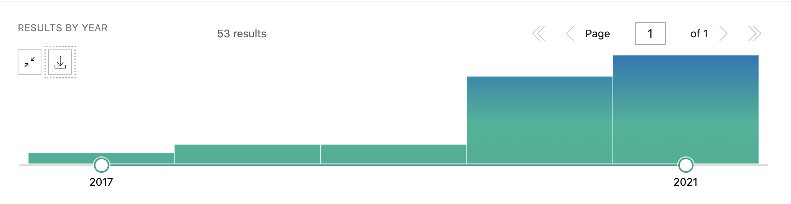
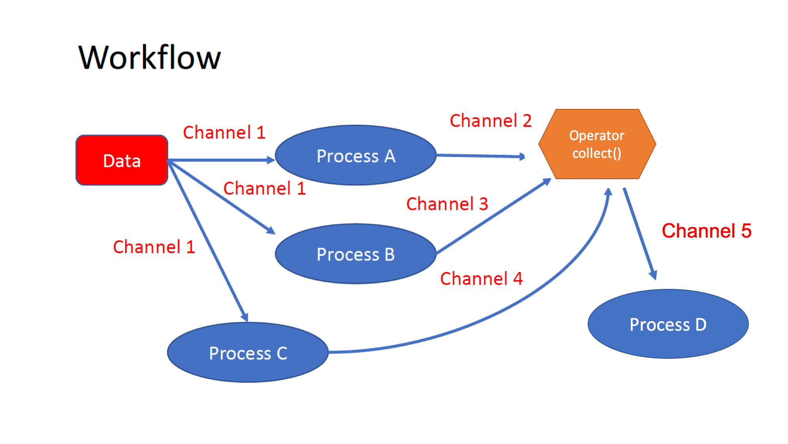

.. _first-page:

*******************
Introduction to Nextflow
*******************

Enabling scalable and reproducible scientific workflows using software containers.  `www.nextflow.io <https://www.nextflow.io>`_.

What is Nextflow?
======================

`Nextflow <https://www.nextflow.io>`__ is a domain specific language (DSL) for workflow orchestration that stems from `Groovy <https://groovy-lang.org/>`__. It enables scalable and reproducible workflows using software containers.
It was developed at the `CRG <www.crg.eu>`__ in the Lab of Cedric Notredame by `Paolo Di Tommaso <https://github.com/pditommaso>`__.
The Nextflow documentation is `available here <https://www.nextflow.io/docs/latest/>`__ and you can ask help to the community using their `gitter channel <https://gitter.im/nextflow-io/nextflow>`__

.. image:: images/nextf_groovy.png
  :width: 600

In 2020, Nextflow has been upgraded from DSL1 version to DSL2. In this course we will use exclusively DSL2.

What is Nextflow for?
---------------------

It is for making pipelines without caring about parallelization, dependencies, intermediate file names, data structures, handling exceptions, resuming executions, etc.

It was published in `Nature Biotechnology in 2017 <https://pubmed.ncbi.nlm.nih.gov/28398311/>`__.

.. image:: images/NF_pub.png
  :width: 600

There is a growing number of `PubMed <https://pubmed.ncbi.nlm.nih.gov/?term=nextflow&timeline=expanded&sort=pubdate&sort_order=asc>`__ publications citing Nextflow.

Here you have a curated list of `Nextflow pipelines <https://github.com/nextflow-io/awesome-nextflow>`__ and a collection of pipelines written collaboratively in the framework of the `NF-core <https://nf-co.re/pipelines>`__ project.

Main advantages
================

Fast prototyping
-------------------

You can quickly write a small pipeline that can be **expanded incrementally**.
**Each task is independent** and can be easily added to other. You can reuse scripts without re-writing or adapting them.

Reproducibility
------------------

Nextflow supports **Docker** and **Singularity** containers technology. Their use will make the pipelines reproducible in any Unix environment. Nextflow is integrated with **GitHub code sharing platform**, so you can call directly a specific version of a pipeline from a repository, download and use it on-the-fly.

Portability
----------------
Nextflow can be executed on **multiple platforms** without modifiying the code. It supports several schedulers such as **SGE, LSF, SLURM, PBS, HTCondor** and cloud platforms like **Kubernetes, Amazon AWS, Google Cloud**.

.. image:: images/executors.png
  :width: 600

Scalability
----------------

Nextflow is based on the **dataflow programming model** which simplifies writing complex pipelines.
The tool takes care of **parallelizing the processes** without additionally written code.
The resulting applications are inherently parallel and can scale-up or scale-out transparently; there is no need to adapt them to a specific platform architecture.

Resumable, thanks to continuous checkpoints
---------------------------------------------

All the intermediate results produced during the pipeline execution are automatically tracked.
For each process **a temporary folder is created and is cached (or not) once resuming an execution**.

Workflow structure
==================

The workflows can be represented as graphs where the nodes are the **processes** and the edges are the **channels**.
The **processes** are blocks of code that can be executed - such as scripts or programs - while the **channels** are asynchronous queues able to **connect processes among them via input / output**.

Processes are independent from each another and can be run in parallel, depending on the number of elements in a channel.
In the previous example, processes **A**, **B** and **C** can be run in parallel and only when they **ALL** end the process **D** is triggered.

Installation
============

.. note::
  You need at least the Java version 8 for the Nextflow installation.

.. tip::
  You can check the version fo java by typing::

    java -version

Then we can install Nextflow with::

  curl -s https://get.nextflow.io | bash

This will create the ``nextflow`` executable that can be moved, for example, to ``/usr/local/bin``.

