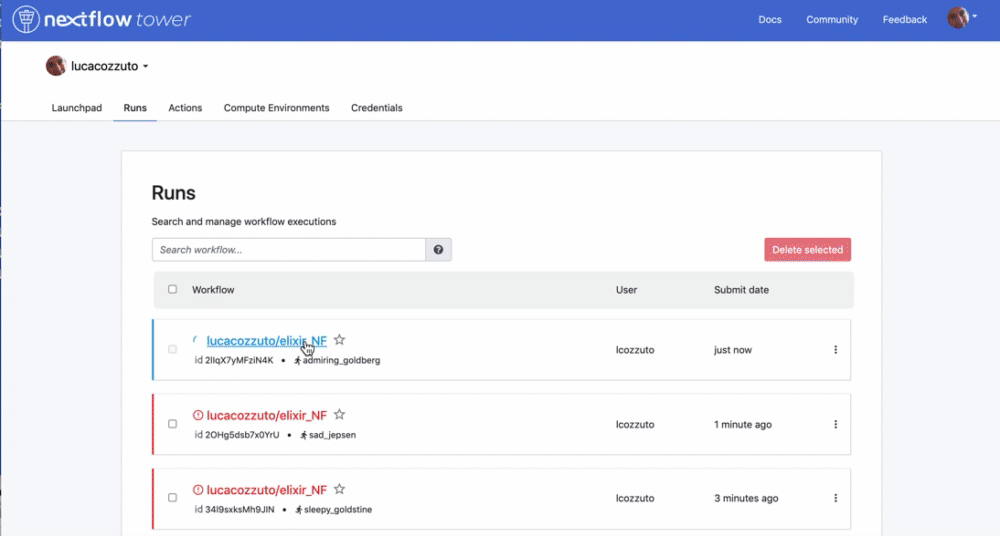

.. _second-page:

*******************
Launching a pipeline
*******************

You can launch a pipeline by simply executing this code

.. code-block:: console

  nextflow run PIPELINENAME.nf

But is really convenient to store your code in one of the sharing platform that are supported.

Sharing Nextflow code
======================

Nextflow supports a number of code sharing platforms: **BitBucket**, **GitHub**, and **GitLab**.
This feature allows running pipelines by just pointing to an online repository without caring about downloading, installing etc. 
The default platform is **GitHub**, so we will use this repository as an example.

.. |github| image:: images/GitHub-Logo.png
  :width: 200

.. |bitbucket| image:: images/bitbucket-logo.png
  :width: 200
  
.. |gitlab| image:: images/gitlab-logo.jpeg
  :width: 200

.. list-table:: 
   :widths: 50 50 50
   :header-rows: 1

   * - GitHub
     - BitBucket
     - GitLab
   * - |github|
     - |bitbucket|
     - |gitlab|

We can launch the pipeline just by typing:

.. code-block:: console

  nextflow run lucacozzuto/elixir_NF -r main

In this way Nextflow will pull the pipeline from the GitHub repository, store it at ``$PATH/.nextflow/assets`` and launch it.

Linux containers
===========================
This pipeline needs tools that are stored within linux containers. In particular we will use images for `Bowtie <http://bowtie-bio.sourceforge.net/index.shtml>`__, `FastQC <https://www.bioinformatics.babraham.ac.uk/projects/fastqc/>`__ and `multiQC <https://multiqc.info/>`__ that are retrieved from `Biocontainers <https://biocontainers.pro/>`__.
For this we need to tell Nextflow which is the right container engine. We can do this by using the Nextflow parameter ``-with-docker``.

Nextflow supports many more container engines like Singularity, Shifter, Podman and Charliecloud. 

.. |docker| image:: images/docker-logo.png
  :width: 200

.. |singularity| image:: images/singularity_logo.jpeg
  :width: 200
  

  

.. list-table:: 
   :widths: 50 50 50 50 50 
   :header-rows: 1

   * - Docker
     - Singularity
     - Shifter
     - Podman
     - Charliecloud
   * - |docker|
     - |singularity|
     - |shifter|
     - |podman|
     - |charlie|

In this example we will use `Docker <https://www.docker.com/>`__: the default image is stored in `DockerHub <https://hub.docker.com/>`__ and is retrieved on the fly. 

.. code-block:: console

  nextflow run lucacozzuto/elixir_NF -r main -with-docker

  N E X T F L O W  ~  version 21.04.3
  Pulling lucacozzuto/elixir_NF ...
  downloaded from https://github.com/lucacozzuto/elixir_NF.git
  Launching `lucacozzuto/elixir_NF` [determined_minsky] - revision: 711f9f806d [main]

  BIOCORE@CRG - N F TESTPIPE  ~  version 1.0
  =============================================
  reads                           : /Users/lcozzuto/.nextflow/assets/lucacozzuto/elixir_NF/data/*.fastq.gz
  reference                       : /Users/lcozzuto/.nextflow/assets/lucacozzuto/elixir_NF/data/chr19.fasta.gz
  output			  : /Users/lcozzuto/.nextflow/assets/lucacozzuto/elixir_NF/output

  executor >  local (3)
  [2f/6cd1ca] process > fastqc (B7_H3K4me1_s_chr19.fastq.gz) [100%] 2 of 2 ✔
  [a2/305aae] process > BOWTIE:Index (chr19.fasta.gz)        [  0%] 0 of 1
  [79/f30f70] process > BOWTIE:Align (B7_H3K4me1_s_chr19.fastq.gz) [100%] 2 of 2 ✔
  [50/088302] process > multiqc                                    [100%] 1 of 1 ✔
  /Users/lcozzuto/ooo/work/27/f1cc39c1e01c9ee55684b347c492f5/B7_input_s_chr19.fastq.gz.sam
  /Users/lcozzuto/ooo/work/27/f1cc39c1e01c9ee55684b347c492f5/B7_input_s_chr19.fastq.gz.log
  /Users/lcozzuto/ooo/work/79/f30f7041abf5baf7c496a0982906c1/B7_H3K4me1_s_chr19.fastq.gz.sam
  /Users/lcozzuto/ooo/work/79/f30f7041abf5baf7c496a0982906c1/B7_H3K4me1_s_chr19.fastq.gz.log

  Done! Open the following report in your browser --> /Users/lcozzuto/.nextflow/assets/lucacozzuto/elixir_NF/output/ouptut_multiQC/multiqc_report.html

  Completed at: 24-Nov-2021 15:48:35
  Duration    : 3m 25s
  CPU hours   : 0.1
  Succeeded   : 6

This pipeline can be launched also with Singularity just using the Nextflow parameter ``-with-singularity``. Nextflow will retrieve and convert the image(s) for you. The image(s) will be then stored so that next time you don't need to download anything again.

We can inspect the output in the new ``output`` folder generated.

.. code-block:: console

  ls -alht output
  
  ls -alht
  total 0
  drwxr-xr-x  17 lcozzuto  staff   544B Nov 24 16:18 ..
  drwxr-xr-x   3 lcozzuto  staff    96B Nov 24 16:13 ouptut_multiQC
  drwxr-xr-x   5 lcozzuto  staff   160B Nov 24 16:13 .
  drwxr-xr-x   4 lcozzuto  staff   128B Nov 24 16:13 ouptut_aln
  drwxr-xr-x   6 lcozzuto  staff   192B Nov 24 16:11 ouptut_fastqc
 
Here you can see the `report <https://lucacozzuto.github.io/elixir_NF/docs/multiqc_report.html>`__ produced by multiQC

Work folder structure and process isolation
===============================

Once executed, we can see that a folder named work is generated. Nextflow stores in this folder the intermediate files generated by each processes. In case you resume a process that folder is "reused" as cache.

At the start of each row, there is an **alphanumeric code**:

.. code-block:: console
  
  [a2/305aae] process > BOWTIE:Index (chr19.fasta.gz)        [  0%] 0 of 1

This code indicates **the path** in which the process is "isolated" and where the corresponding temporary files are kept in the **work** directory. 

.. note::
	Nextflow will randomly generate temporary folders so they will be named differently in your execution.

Let's have a look inside that folder:

.. code-block:: console

	cd work/a2/305aaee297250b0c7a455cab35707c/
	ls -alht

	-rw-r--r--   1 lcozzuto  staff    20M Nov 24 16:12 chr19.fasta.gz.rev.1.ebwt
	-rw-r--r--   1 lcozzuto  staff   6.9M Nov 24 16:12 chr19.fasta.gz.rev.2.ebwt
	-rw-r--r--   1 lcozzuto  staff    20M Nov 24 16:11 chr19.fasta.gz.1.ebwt
	-rw-r--r--   1 lcozzuto  staff   6.9M Nov 24 16:11 chr19.fasta.gz.2.ebwt
	-rw-r--r--   1 lcozzuto  staff    53B Nov 24 16:10 chr19.fasta.gz.3.ebwt
	-rw-r--r--   1 lcozzuto  staff    14M Nov 24 16:10 chr19.fasta.gz.4.ebwt
	lrwxr-xr-x   1 lcozzuto  staff    74B Nov 24 16:10 chr19.fasta.gz -> /Users/lcozzuto/.nextflow/assets/lucacozzuto/elixir_NF/data/chr19.fasta.gz

You can see the input files staged as links, the output files and some "hidden" files in which we have different information:

- **.exitcode**, contains 0 if everything is ok, another value if there was a problem.
- **.command.log**, contains the log of the command execution. It is often identical to `.command.out`
- **.command.out**, contains the standard output of the command execution
- **.command.err**, contains the standard error of the command execution
- **.command.begin**, contains what has to be executed before `.command.sh`
- **.command.sh**, contains the block of code indicated in the process
- **.command.run**, contains the code made by nextflow for the execution of `.command.sh`, and contains environmental variables, eventual invocations of linux containers etc.

Resuming and changing parameters 
=================================

We can copy a fastq files in another place and change the file name:

.. code-block:: console

	cp $PATH/.nextflow/assets/lucacozzuto/elixir_NF/data/*.gz .
	mv B7_H3K4me1_s_chr19.fastq.gz test2.fastq.gz
        mv B7_input_s_chr19.fastq.gz test1.fastq.gz

Then we can execute again the pipeline feeding the new input files by using the pipeline parameter ``--reads ""``

.. note::
	Nextflow parameters are indicated by one dash (-). Pipeline parameters by two dahses (\-\-)

You can execute again the pipeline by using the Nextflow parameter ``-resume`` and send it to background with ``-bg``. 

.. code-block:: console

  nextflow run lucacozzuto/elixir_NF -with-docker -r main -bg --reads "*.fastq.gz" -resume > log
  
  	cat log 
  
	N E X T F L O W  ~  version 21.10.3
	Launching `lucacozzuto/elixir_NF` [jolly_visvesvaraya] - revision: 040cd63a79 [main]
	NOTE: Your local project version looks outdated - a different revision is available in the remote repository [cf2612db62]

	BIOCORE@CRG - N F TESTPIPE  ~  version 1.0
	=============================================
	reads                           : *.fastq.gz
	reference                       : /Users/lcozzuto/.nextflow/assets/lucacozzuto/elixir_NF/data/chr19.fasta.gz
	output				: ./output

	[8b/cfcc4f] Submitted process > fastqc (test1.fastq.gz)
	[5b/71ae88] Submitted process > fastqc (test2.fastq.gz)
	[6e/1cc3be] Cached process > BOWTIE:Index (chr19.fasta.gz)
	[97/2a6a72] Submitted process > BOWTIE:Align (test2.fastq.gz)
	[0a/951748] Submitted process > BOWTIE:Align (test1.fastq.gz)
	/Users/lcozzuto/ooo/work/97/2a6a7245675d7913019aa8983c5e55/test2.fastq.gz.log
	/Users/lcozzuto/ooo/work/97/2a6a7245675d7913019aa8983c5e55/test2.fastq.gz.sam
	/Users/lcozzuto/ooo/work/0a/9517481ef43b0e88163ec5f8b4d71f/test1.fastq.gz.log
	/Users/lcozzuto/ooo/work/0a/9517481ef43b0e88163ec5f8b4d71f/test1.fastq.gz.sam
	[f7/1b5746] Submitted process > multiqc

	Done! Open the following report in your browser --> ./output/ouptut_multiQC/multiqc_report.html

You can see that the **indexing** of the genome is cached while the processes that are influenced by the new files are triggered. 

Reporting and monitoring
=========================

Before going to the code we can have a look to two important features of Nextflow: the ability to produce a comprehensive report and the live monitoring offered by **tower.nf** web application.

We can go to the `tower.nf <https://tower.nf/login>`__ website

.. image:: images/tower.png
  :width: 800

and click on the **GitHub** authentication.

.. image:: images/tower.png
  :width: 800

You can generate your token at `https://tower.nf/tokens <https://tower.nf/tokens>`__ exporting those environmental variables:

.. code-block:: console

	export TOWER_ACCESS_TOKEN=*******YOUR***TOKEN*****HERE*******

.. note::
	You can also store them indefinitely in your **.bashrc** or **.bash_profile** file.

We can then launch again the pipeline forcing this time without ``-resume`` and check the live reporting on the tower website adding the parameter ``-with-tower``.

.. code-block:: console

	nextflow run lucacozzuto/elixir_NF -with-docker -r main -bg --reads "*.fastq.gz" -with-tower > log
	
	tail -f log
	
	N E X T F L O W  ~  version 21.10.3
	Launching `lucacozzuto/elixir_NF` [evil_ekeblad] - revision: 040cd63a79 [main]
	NOTE: Your local project version looks outdated - a different revision is available in the remote repository [fb23636633]
	Downloading plugin nf-tower@1.3.0

	BIOCORE@CRG - N F TESTPIPE  ~  version 1.0
	=============================================
	reads                           : *.fastq.gz
	reference                       : /Users/lcozzuto/.nextflow/assets/lucacozzuto/elixir_NF/data/chr19.fasta.gz
	output				: ./output

	Monitor the execution with Nextflow Tower using this url https://tower.nf/user/lucacozzuto/watch/54kIaLzfwIfiLx
	[23/b06dda] Submitted process > fastqc (test1.fastq.gz)
	[ee/82bce0] Submitted process > fastqc (test2.fastq.gz)
	[27/82af32] Submitted process > BOWTIE:Index (chr19.fasta.gz)
	[...]

We can check the appearance of a new pipeline and the content

  
  
When the pipeline is finished you also get a mail. Adding the parameter ``-with-report`` will produce a final `html report <https://lucacozzuto.github.io/elixir_NF/docs/report.html>`__ with all the information that was in the tower.nf website.

